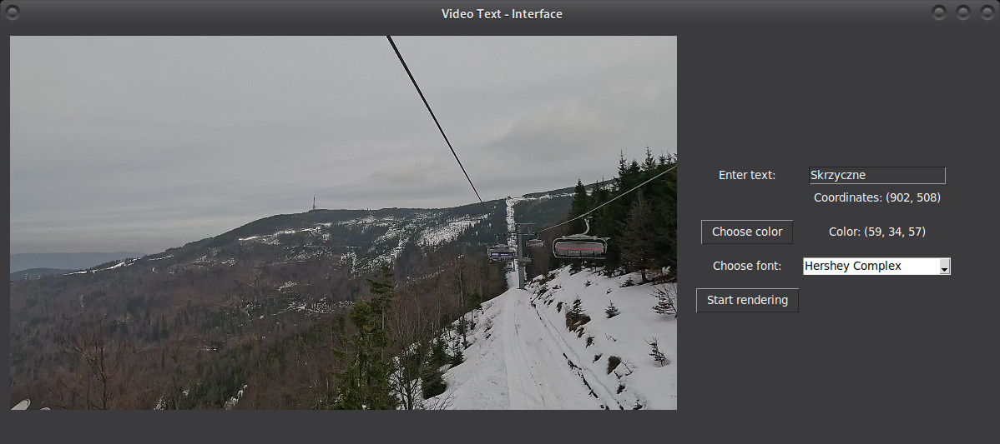

# VideoPointer



## Description
This script allows adding text to a video at a specified point based on motion tracking. It uses the OpenCV library for video analysis and Tkinter for the graphical interface.

## Requirements
- Python 3
- OpenCV (`cv2`)
- NumPy
- Tkinter
- PIL (Pillow)

To install the required packages, run:
```sh
pip install opencv-python numpy pillow
```

## How to Use
1. Run the script:
   ```sh
   python script.py
   ```
2. Select a point on the first frame where the text should appear.
3. Enter the desired text in the form field.
4. Choose the text color.
5. Select a font.
6. Click "Start Rendering" to generate a new video with the overlayed text.

After rendering is complete, the output file will be saved as `output.mp4`.

## Project Structure
```
/
├── script.py  # Main application script
├── input.mp4  # Input video file (must be provided)
├── output.mp4 # Output video file
```

## Additional Information
- The text follows the selected point in the frame using the Optical Flow algorithm.
- The Tkinter interface allows interactive text configuration before processing.
- The script supports various OpenCV fonts.
